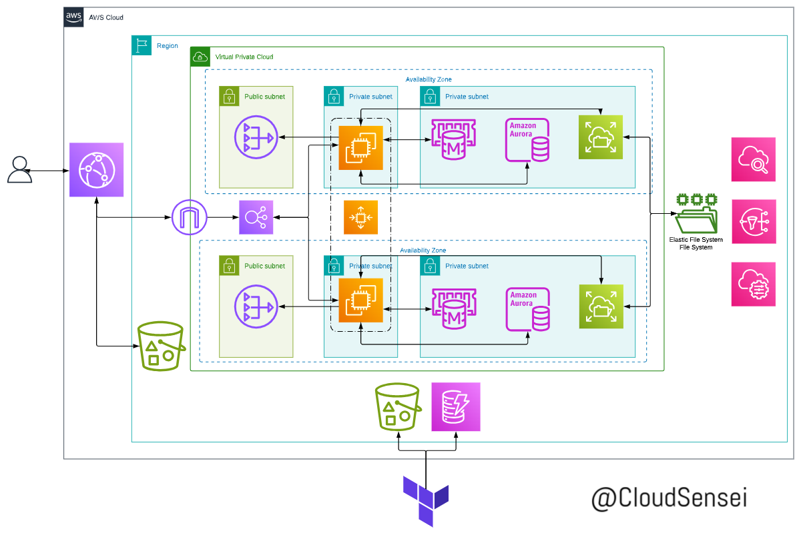

# Infrastructure Deployment Configuration

This markdown provides a brief overview of the Terraform configuration for deploying infrastructure components.

## Architecture



## Description

The provided Terraform configuration sets up a scalable infrastructure for deploying a WordPress application on AWS. It includes modules for setting up a Virtual Private Cloud (VPC), Aurora database, Elasticache for caching, Elastic File System (EFS) for file storage, a load balancer, and CloudFront for content delivery.

## AWS Configuration

Ensure that you have the necessary AWS credentials configured locally to authenticate Terraform with your AWS account. You can set up AWS credentials by following these steps:

1. **Create IAM User**: Log in to the AWS Management Console, navigate to the IAM service, and create a new IAM user with programmatic access.

2. **Attach Policies**: Attach policies such as `AmazonEC2FullAccess`, `AmazonRDSFullAccess`, `AmazonElasticFileSystemFullAccess`, `AmazonElastiCacheFullAccess`, `AmazonVPCFullAccess`, and any other policies required by your infrastructure to the IAM user.

3. **Access Key and Secret Key**: After creating the IAM user, generate an access key ID and secret access key. Keep these credentials secure.

4. **Configure AWS CLI**: Install AWS CLI on your local machine if you haven't already. Run `aws configure` command and provide the access key ID, secret access key, default region, and default output format.

    ```bash
    aws configure
    ```

## Applying the Configuration

To apply this configuration, follow these steps:

1. **Install Terraform**: Ensure Terraform is installed on your local machine. You can download it from the [official website](https://www.terraform.io/downloads.html) and follow the installation instructions.

2. **Initialize the Working Directory**: Navigate to the directory containing your Terraform configuration files using the command line and run the following command to initialize Terraform:

    ```bash
    terraform init
    ```

3. **Review Plan**: Run the following command to generate an execution plan. This step is optional but recommended to review the changes that Terraform will make:

    ```bash
    terraform plan
    ```

4. **Apply Configuration**: Apply the Terraform configuration to create or modify the infrastructure resources. Run the following command:

    ```bash
    terraform apply -var-file terraform.tfvars
    ```

5. **Confirm Changes**: Terraform will display the planned actions and prompt for confirmation. Type `yes` to apply the changes.

6. **Wait for Completion**: Wait for Terraform to provision the infrastructure. This process may take several minutes.

7. **Verify Deployment**: Once Terraform has completed applying the configuration, verify the deployment by checking the AWS Management Console or using AWS CLI commands.

8. **Destroy Infrastructure (Optional)**: If you want to tear down the infrastructure created by Terraform, run the following command:

    ```bash
    terraform destroy
    ```

    Confirm the destruction by typing `yes`.

9. **Clean Up**: After destroying the infrastructure, ensure all resources are terminated properly in the AWS Management Console to avoid incurring unnecessary costs.


## Requirements

| Name | Version |
|------|---------|
| <a name="requirement_aws"></a> [aws](#requirement\_aws) | ~> 5.0 |

## Providers

| Name | Version |
|------|---------|
| <a name="provider_aws"></a> [aws](#provider\_aws) | 5.38.0 |

## Modules

| Name | Source | Version |
|------|--------|---------|
| <a name="module_app"></a> [app](#module\_app) | ./modules/wordpress | n/a |
| <a name="module_cache"></a> [cache](#module\_cache) | ./modules/elasticache | n/a |
| <a name="module_cloudfront"></a> [cloudfront](#module\_cloudfront) | ./modules/cloudfront | n/a |
| <a name="module_database"></a> [database](#module\_database) | ./modules/aurora | n/a |
| <a name="module_filesystem"></a> [filesystem](#module\_filesystem) | ./modules/efs | n/a |
| <a name="module_loadbalancer"></a> [loadbalancer](#module\_loadbalancer) | ./modules/loadbalancer | n/a |
| <a name="module_vpc"></a> [vpc](#module\_vpc) | ./modules/vpc | n/a |

## Resources

| Name | Type |
|------|------|
| [aws_cloudwatch_metric_alarm.ec2_cpu_alarm](https://registry.terraform.io/providers/hashicorp/aws/latest/docs/resources/cloudwatch_metric_alarm) | resource |
| [aws_dynamodb_table.terraform_lock](https://registry.terraform.io/providers/hashicorp/aws/latest/docs/resources/dynamodb_table) | resource |
| [aws_iam_instance_profile.instance_profile](https://registry.terraform.io/providers/hashicorp/aws/latest/docs/resources/iam_instance_profile) | resource |
| [aws_iam_role.wordpress_execution_role](https://registry.terraform.io/providers/hashicorp/aws/latest/docs/resources/iam_role) | resource |
| [aws_iam_role_policy.efs_execution_role_policy](https://registry.terraform.io/providers/hashicorp/aws/latest/docs/resources/iam_role_policy) | resource |
| [aws_iam_role_policy.s3_bucket_policy](https://registry.terraform.io/providers/hashicorp/aws/latest/docs/resources/iam_role_policy) | resource |
| [aws_iam_role_policy.ssm_execution_role_policy](https://registry.terraform.io/providers/hashicorp/aws/latest/docs/resources/iam_role_policy) | resource |
| [aws_s3_bucket.bucket](https://registry.terraform.io/providers/hashicorp/aws/latest/docs/resources/s3_bucket) | resource |
| [aws_s3_bucket.terraform_state](https://registry.terraform.io/providers/hashicorp/aws/latest/docs/resources/s3_bucket) | resource |
| [aws_s3_bucket_acl.bucket_acl](https://registry.terraform.io/providers/hashicorp/aws/latest/docs/resources/s3_bucket_acl) | resource |
| [aws_s3_bucket_ownership_controls.ownership](https://registry.terraform.io/providers/hashicorp/aws/latest/docs/resources/s3_bucket_ownership_controls) | resource |
| [aws_s3_bucket_server_side_encryption_configuration.bucket_encryption](https://registry.terraform.io/providers/hashicorp/aws/latest/docs/resources/s3_bucket_server_side_encryption_configuration) | resource |
| [aws_s3_bucket_server_side_encryption_configuration.encrypt](https://registry.terraform.io/providers/hashicorp/aws/latest/docs/resources/s3_bucket_server_side_encryption_configuration) | resource |
| [aws_s3_bucket_versioning.bucket_version](https://registry.terraform.io/providers/hashicorp/aws/latest/docs/resources/s3_bucket_versioning) | resource |
| [aws_sns_topic.topic](https://registry.terraform.io/providers/hashicorp/aws/latest/docs/resources/sns_topic) | resource |
| [aws_sns_topic_subscription.email_subscription](https://registry.terraform.io/providers/hashicorp/aws/latest/docs/resources/sns_topic_subscription) | resource |
| [aws_ami.amazon_linux_2_latest](https://registry.terraform.io/providers/hashicorp/aws/latest/docs/data-sources/ami) | data source |
| [aws_availability_zones.availability_zones](https://registry.terraform.io/providers/hashicorp/aws/latest/docs/data-sources/availability_zones) | data source |
| [aws_instances.instances](https://registry.terraform.io/providers/hashicorp/aws/latest/docs/data-sources/instances) | data source |

## Inputs

| Name | Description | Type | Default | Required |
|------|-------------|------|---------|:--------:|
| <a name="input_app_instance_type"></a> [app\_instance\_type](#input\_app\_instance\_type) | The type of instance for the application. | `string` | n/a | yes |
| <a name="input_attribute_name"></a> [attribute\_name](#input\_attribute\_name) | The name of the attribute in the DynamoDB table. | `string` | n/a | yes |
| <a name="input_attribute_type"></a> [attribute\_type](#input\_attribute\_type) | The type of the attribute in the DynamoDB table. | `string` | n/a | yes |
| <a name="input_backend_bucket"></a> [backend\_bucket](#input\_backend\_bucket) | The name of the S3 bucket. | `string` | n/a | yes |
| <a name="input_backend_bucket_key"></a> [backend\_bucket\_key](#input\_backend\_bucket\_key) | The key in the backend bucket. | `string` | n/a | yes |
| <a name="input_billing_mode"></a> [billing\_mode](#input\_billing\_mode) | The billing mode for DynamoDB (e.g., PROVISIONED, PAY\_PER\_REQUEST). | `string` | n/a | yes |
| <a name="input_db_password"></a> [db\_password](#input\_db\_password) | The password for accessing the database. | `string` | n/a | yes |
| <a name="input_db_username"></a> [db\_username](#input\_db\_username) | The username for accessing the database. | `string` | n/a | yes |
| <a name="input_dynamodb_table"></a> [dynamodb\_table](#input\_dynamodb\_table) | The name of the DynamoDB table. | `string` | n/a | yes |
| <a name="input_email_address"></a> [email\_address](#input\_email\_address) | n/a | `list(string)` | <pre>[<br>  "bodunwamayowa@gmail.com"<br>]</pre> | no |
| <a name="input_hash_key"></a> [hash\_key](#input\_hash\_key) | The hash key for the DynamoDB table. | `string` | n/a | yes |
| <a name="input_object_bucket"></a> [object\_bucket](#input\_object\_bucket) | n/a | `string` | n/a | yes |
| <a name="input_region"></a> [region](#input\_region) | The AWS region where resources will be provisioned. | `string` | n/a | yes |

## Outputs

| Name | Description |
|------|-------------|
| <a name="output_cloudfront_url"></a> [cloudfront\_url](#output\_cloudfront\_url) | n/a |
| <a name="output_loadbalancer"></a> [loadbalancer](#output\_loadbalancer) | n/a |