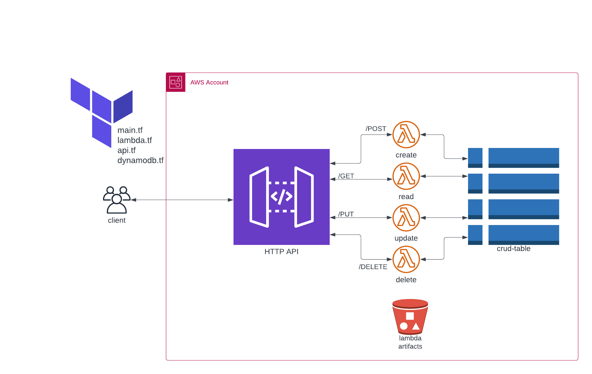

# serverless-crud-http-api
This CRUD HTTP API is built using Terraform, DynamoDB, Lambda, and Python on AWS. It enables users to create, read, update, and delete items stored in a DynamoDB table through HTTP requests. Terraform is used to provision infrastructure resources, such as the API Gateway, DynamoDB table, and Lambda functions.

    

# Requirements

* [Terraform CLI](https://developer.hashicorp.com/terraform/downloads)
* [AWS CLI v2](https://docs.aws.amazon.com/cli/latest/userguide/getting-started-install.html) with AWS Account Configured
* [Python 3.10](https://www.python.org/downloads/)

# Scripts

* ### create.sh

`chmod +x ./create.sh`

### Usage:

`./create.sh create read update delete`

This script automates the process of creating a CRUD serverless API on AWS using Lambda functions, Terraform and Python. To use the script, follow the steps below:

    - Ensure that you have the necessary dependencies installed including Terraform and AWS CLI.

    - Clone the repository and navigate to the root directory.

    - Execute the script with the following arguments: create, read, update and delete.

    - When prompted, enter the region you want to deploy the infrastructure in.

    - Wait for the script to complete the following actions:
        Compress the Lambda functions
        Create an S3 bucket
        Copy the compressed functions to the S3 bucket
        Create the infrastructure using Terraform.

The serverless API is now up and running, and can be tested using the endpoints generated by the script.
    
* ### crud-tests.sh

`chmod +x ./crud-tests.sh`

### Usage:

`./create.sh arg1 arg2`

This script is used to interact with a CRUD HTTP API built with DynamoDB and Lambda on AWS.

    - Clone the repository to your local machine.
    
    - Navigate to the root directory
    
    - Set the correct file permissions for the Bash script (e.g., chmod +x crud-script.sh).
    
    - Run the script with the following command: ./crud-script.sh [ARG1] [ARG2]
        ARG1 can be one of the following CRUD operations: create, read, readone, update, or delete.
        ARG2 should be the API endpoint you want to connect to.
        
    - Follow the prompts for each operation.
    
* ### delete.sh

`chmod +x ./delete.sh`

### Usage:

`./delete.sh`

This Bash script is designed to delete an AWS S3 bucket and its associated infrastructure using the AWS CLI and Terraform.
## Requirements

| Name | Version |
|------|---------|
|  [terraform](#requirement\_terraform) | >= 1.2.0 |
|  [aws](#requirement\_aws) | ~> 5.0.0 |

## Providers

| Name | Version |
|------|---------|
|  [aws](#provider\_aws) | 5.0.1 |

## Modules

No modules.

## Resources

| Name | Type |
|------|------|
| [aws_apigatewayv2_api.api](https://registry.terraform.io/providers/hashicorp/aws/latest/docs/resources/apigatewayv2_api) | resource |
| [aws_apigatewayv2_integration.api_integrations](https://registry.terraform.io/providers/hashicorp/aws/latest/docs/resources/apigatewayv2_integration) | resource |
| [aws_apigatewayv2_route.route](https://registry.terraform.io/providers/hashicorp/aws/latest/docs/resources/apigatewayv2_route) | resource |
| [aws_apigatewayv2_route.routes](https://registry.terraform.io/providers/hashicorp/aws/latest/docs/resources/apigatewayv2_route) | resource |
| [aws_apigatewayv2_stage.stage](https://registry.terraform.io/providers/hashicorp/aws/latest/docs/resources/apigatewayv2_stage) | resource |
| [aws_dynamodb_table.crud_table](https://registry.terraform.io/providers/hashicorp/aws/latest/docs/resources/dynamodb_table) | resource |
| [aws_iam_role.role](https://registry.terraform.io/providers/hashicorp/aws/latest/docs/resources/iam_role) | resource |
| [aws_iam_role_policy.policy](https://registry.terraform.io/providers/hashicorp/aws/latest/docs/resources/iam_role_policy) | resource |
| [aws_lambda_function.functions](https://registry.terraform.io/providers/hashicorp/aws/latest/docs/resources/lambda_function) | resource |
| [aws_lambda_permission.apigw_permission](https://registry.terraform.io/providers/hashicorp/aws/latest/docs/resources/lambda_permission) | resource |
| [aws_lambda_permission.apigw_permissions](https://registry.terraform.io/providers/hashicorp/aws/latest/docs/resources/lambda_permission) | resource |
| [aws_caller_identity.current](https://registry.terraform.io/providers/hashicorp/aws/latest/docs/data-sources/caller_identity) | data source |

## Inputs

| Name | Description | Type | Default | Required |
|------|-------------|------|---------|:--------:|
|  [bucket](#input\_bucket) | name of lambda function bucket | `string` | n/a | yes |
|  [source\_arn](#input\_source\_arn) | n/a | `list(string)` | <pre>[   "/*/POST/items",   "/*/GET/items",   "/*/GET/items/{id}",   "/*/PUT/items/{id}",   "/*/DELETE/items/{id}" ]</pre> | no |

## Outputs

| Name | Description |
|------|-------------|
|  [api\_endpoint](#output\_api\_endpoint) | Test API endpoint with this address |
